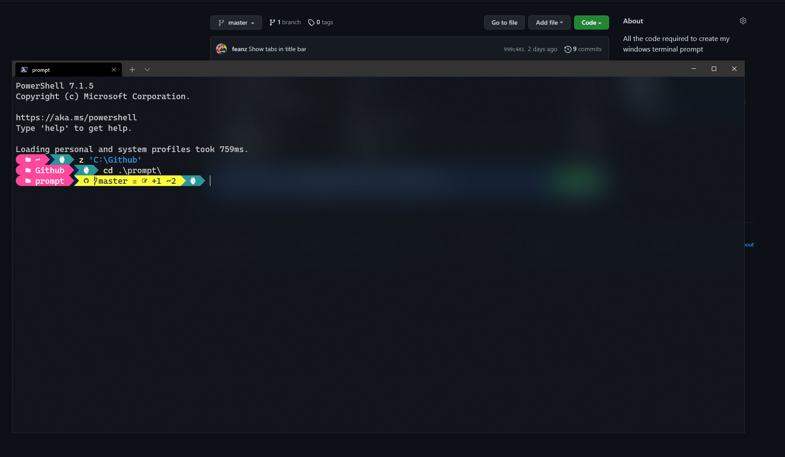

# Windows Terminal Setup 

This repo has all the configuration needed to setup my windows terminal. 

1. Clone this repo to a c:\git folder
1. Install chocolatey 
1. Run each line in the setup.ps1 included in the repo
1. Update the terminal settings Json file
1. Copy the powershell profile file into you local powershell profile (make sure this is for powershell core)
1. Copy the gitconfig file and alias file into your home directory
