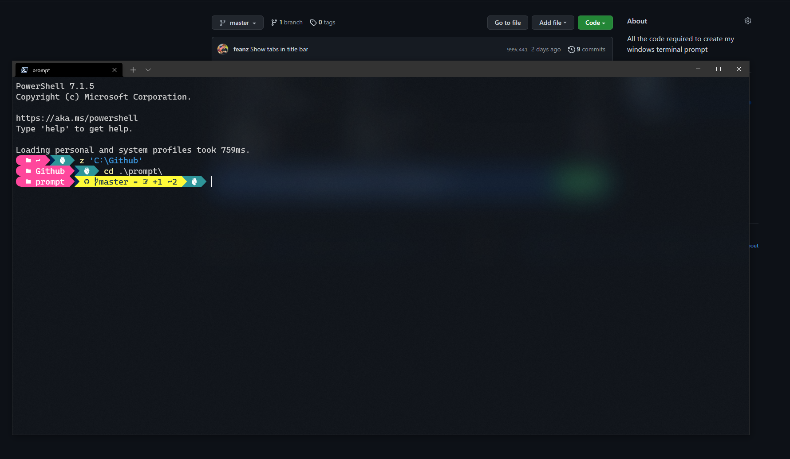

# Windows setup

Run `setup.ps1` from an elevated PowerShell session after installing Chocolatey.

```powershell
Set-ExecutionPolicy -Scope Process Bypass
.\windows\setup.ps1
```

The script installs or upgrades the configured Chocolatey packages, installs `Terminal-Icons` and `z`, configures the shared Git include, and adds the repository-managed profile to the PowerShell profile.

## Windows Terminal

The terminal settings are not replaced by default. To install them:

```powershell
.\windows\setup.ps1 -InstallTerminalSettings
```

The current settings file is copied to a timestamped backup before replacement. Windows Terminal must have been launched at least once so its settings directory exists.

## Managed configuration

The setup copies these files to `~/.config/prompt`:

- Shared Oh My Posh theme
- Shared Git config and aliases
- Windows-specific Git line-ending, editor, and KDiff3 settings
- PowerShell prompt profile

It then adds a single dot-source line to the user's PowerShell profile. Re-run setup after pulling changes so copied files are refreshed.

The Explorer helper enables hidden files, file extensions, and protected operating system files, then attempts to restart Explorer for the current user.


